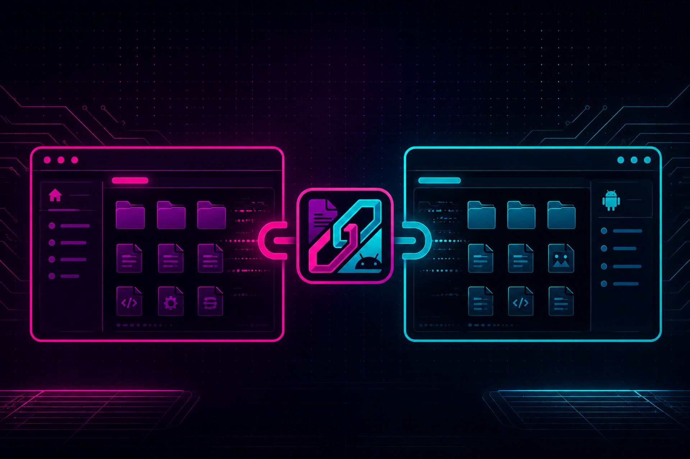

# adbrose

A cross-platform, keyboard-driven TUI file browser for local and Android filesystems — side by side.

Built with Rust, [ratatui](https://ratatui.rs/), and [crossterm](https://github.com/crossterm-rs/crossterm). Powered by ADB for all Android access (no MTP).

---

## Table of Contents

- [About](#about)
- [Features](#features)
- [Tech Stack](#tech-stack)
- [Architecture](#architecture)
- [Project Structure](#project-structure)
- [Getting Started](#getting-started)
- [Configuration](#configuration)
- [Usage](#usage)
- [Keyboard Shortcuts](#keyboard-shortcuts)
- [Troubleshooting](#troubleshooting)
- [What's Next](#whats-next)
- [Contributing](#contributing)
- [License](#license)
- [Author](#author)

---

## About

adbrose solves a specific pain point: moving files between your computer and Android phone without dealing with MTP, GUI file managers, or slow drag-and-drop. It presents two panes — your local filesystem on the left, your phone's storage on the right — and lets you navigate, select, copy, delete, and rename entirely from the keyboard.

All Android access goes through the `adb` command-line tool, which means it works over USB and is reliable where MTP fails.

## Features

- **Dual-pane layout** — local filesystem on the left, Android `/sdcard` on the right
- **ADB-powered** — all Android access goes through `adb` (no MTP, no fuse)
- **File operations** — copy, delete, rename, create folders
- **Async transfers** — non-blocking push/pull with a progress bar and transfer queue
- **Tar-streaming** — faster directory pulls via `adb exec-out tar` (enabled by default)
- **Bookmarks** — save and jump to favorite paths on either pane
- **Multi-device** — device picker when multiple phones are connected
- **Filter/search** — quickly narrow down files in the current directory
- **Keyboard-driven** — full vim-style navigation with a help popup (`?`)
- **Configurable** — TOML config file for defaults, serial, and transfer settings

## Tech Stack

| Component | Technology |
|-----------|-----------|
| Language | Rust (Edition 2021) |
| TUI Framework | [ratatui](https://ratatui.rs/) 0.30 |
| Terminal Backend | [crossterm](https://github.com/crossterm-rs/crossterm) 0.29 |
| Async Runtime | [tokio](https://tokio.rs/) 1 (full features) |
| CLI Parsing | [clap](https://docs.rs/clap) 4 (derive) |
| Error Handling | [anyhow](https://docs.rs/anyhow) 1 + [thiserror](https://docs.rs/thiserror) 2 |
| Configuration | [serde](https://serde.rs) + [toml](https://docs.rs/toml) 0.8 |
| Logging | [tracing](https://docs.rs/tracing) 0.1 + [tracing-subscriber](https://docs.rs/tracing-subscriber) 0.3 |
| Versioning | CalVer (`YYYY.MM.MICRO`) |

## Architecture

```
┌──────────────────────────────────────────────────┐
│                    main.rs                        │
│  CLI parse → Config load → Terminal setup         │
│  → Event loop (Key / Tick / TransferProgress)     │
└──────────┬──────────┬──────────┬─────────────────┘
           │          │          │
     ┌─────▼──┐  ┌────▼────┐  ┌─▼──────────┐
     │ app.rs │  │ ui.rs   │  │ input.rs   │
     │ State  │  │ Render  │  │ Key handler│
     └────┬───┘  └─────────┘  └─────┬──────┘
          │                          │
    ┌─────┴──────┐         ┌────────┴─────────┐
    │            │         │                  │
┌───▼───┐  ┌────▼─────┐  ┌▼────────┐  ┌──────▼──────┐
│adb.rs │  │local_fs  │  │transfer │  │ file_entry  │
│ADB    │  │Local FS  │  │Queue    │  │ FileEntry   │
│client │  │ops       │  │+ jobs   │  │ Device      │
└───────┘  └──────────┘  └─────────┘  └─────────────┘
```

**Key abstractions:**

- **`AdbClient`** — wraps all `adb` CLI invocations (sync for listing, async for transfers). Handles device detection, shell commands, push/pull with progress, and tar-streaming.
- **`App`** — holds all application state: both pane states, the active modal, input mode, transfer queue, and config reference.
- **`PaneState`** — per-pane state: current path, file entries, cursor position, selection set, and filter string.
- **`TransferQueue`** — manages pending/active/completed transfer jobs with progress tracking. Only one transfer runs at a time; others queue automatically.

**Data flow:**

1. `main.rs` parses CLI args, loads config, sets up the terminal, and starts the tokio event loop
2. A blocking thread polls crossterm for key events and sends them over an `mpsc` channel
3. `input.rs` handles each key event, mutating `App` state
4. `ui.rs` renders the current state every frame via ratatui
5. File copies spawn async tasks that report progress back through the channel

## Project Structure

```
adbrose/
├── Cargo.toml              # Package manifest, dependencies
├── Cargo.lock              # Locked dependency versions
├── CHANGELOG.md            # Version history (CalVer)
├── README.md               # This file
├── docs/
│   └── hero.jpg            # Screenshot for the README header
├── .github/
│   └── workflows/
│       └── release.yml     # CI: build binaries on tag push
└── src/
    ├── main.rs             # Entry point, terminal setup, event loop
    ├── cli.rs              # CLI argument parsing (clap derive)
    ├── config.rs           # TOML config load/save, config path resolution
    ├── app.rs              # App state, PaneState, Modal/InputMode enums
    ├── ui.rs               # ratatui rendering (panes, modals, status bar)
    ├── input.rs            # Key event routing and action dispatch
    ├── adb.rs              # ADB client: device list, ls, push, pull, tar
    ├── local_fs.rs         # Local filesystem operations (std::fs wrappers)
    ├── file_entry.rs       # FileEntry, FileKind, Device types + sorting
    ├── transfer.rs         # TransferQueue, TransferJob, TransferStatus
    └── error.rs            # AppError enum (thiserror)
```

## Getting Started

### Prerequisites

- **Rust stable** — install via [rustup](https://rustup.rs/)
- **ADB** — Android Debug Bridge (required at runtime for Android features)

### Install ADB

| Platform | Command |
|----------|---------|
| macOS | `brew install android-platform-tools` |
| Ubuntu/Debian | `sudo apt install adb` |
| Arch | `sudo pacman -S android-tools` |
| Windows | Download from [developer.android.com](https://developer.android.com/tools/releases/platform-tools) |

### Build & Run

```bash
git clone https://github.com/thebennies/adbrose.git
cd adbrose
cargo run
```

For an optimized binary:

```bash
cargo build --release
./target/release/adbrose
```

Or install globally:

```bash
cargo install --path .
adbrose
```

### Android Device Setup

1. Enable **Developer Options**: Settings → About phone → tap Build number 7 times
2. Enable **USB Debugging**: Settings → Developer options → USB debugging
3. Connect your device via USB
4. Accept the **computer fingerprint prompt** on your phone
5. Verify with `adb devices` — you should see your device listed

## Configuration

adbrose looks for a config file at:

| Platform | Path |
|----------|------|
| macOS | `~/Library/Application Support/adbrose/config.toml` |
| Linux | `~/.config/adbrose/config.toml` |
| Windows | `%APPDATA%\adbrose\config.toml` |

If the file doesn't exist, adbrose runs with defaults. The file is created automatically when you save bookmarks.

### Example `config.toml`

```toml
[defaults]
android_path = "/sdcard/Download"
local_path = "/home/user/Downloads"
serial = "abc123"

[transfer]
use_tar_streaming = true

[bookmarks]
work = "/sdcard/Projects"
photos = "/sdcard/DCIM/Camera"
```

### CLI Flags

CLI flags override config file values:

```bash
adbrose --android-path /sdcard/Download \
        --local-path ~/Downloads \
        --serial abc123 \
        --log-file ~/.adbrose.log
```

| Flag | Default | Description |
|------|---------|-------------|
| `--android-path` | `/sdcard` | Starting directory on Android pane |
| `--local-path` | Current directory | Starting directory on local pane |
| `--serial` | Auto-detect | ADB device serial number |
| `--log-file` | None | Write debug logs to this file |

## Usage

```bash
# Default: local cwd ↔ Android /sdcard
adbrose

# Custom paths
adbrose --android-path /sdcard/Download --local-path ~/Downloads

# Specific device
adbrose --serial R5CR80XXXX

# With debug logging
adbrose --log-file /tmp/adbrose.log
```

## Keyboard Shortcuts

| Key | Action |
|-----|--------|
| **Navigation** | |
| `Tab` | Switch active pane (local ↔ Android) |
| `↑` / `k` | Move selection up |
| `↓` / `j` | Move selection down |
| `PgUp` | Scroll up 10 entries |
| `PgDn` | Scroll down 10 entries |
| `Enter` / `l` | Enter directory |
| `Backspace` / `h` | Go to parent directory |
| **Selection** | |
| `Space` | Toggle file selection |
| `a` | Select all in current directory |
| `Esc` | Clear selection / close modal |
| **File Operations** | |
| `c` | Copy selected files to opposite pane |
| `d` | Delete selected files (with confirmation) |
| `r` | Rename selected file |
| `n` | Create new folder |
| **Transfers** | |
| `t` | View transfer queue |
| `x` | Cancel active transfer |
| **Other** | |
| `b` | Open bookmarks |
| `s` | Save current path as bookmark |
| `/` | Filter / search current pane |
| `R` | Refresh active pane |
| `?` | Help popup |
| `q` | Quit |

## Troubleshooting

| Problem | Solution |
|---------|----------|
| `adb: command not found` | Install ADB (see [Getting Started](#getting-started)) |
| No device detected | Check USB connection, run `adb devices` manually |
| Device unauthorized | Accept the USB debugging prompt on your phone |
| Permission denied on `/sdcard` | Some paths are restricted — try `/sdcard` first |
| Terminal looks broken after crash | Run `reset` to restore terminal state |
| Multiple devices listed | Use `--serial <device_id>` or pick from the device picker |
| Transfer seems stuck | Press `x` to cancel, then `R` to refresh |

## What's Next

- [ ] Windows terminal compatibility testing
- [ ] Configurable color themes
- [ ] File preview pane
- [ ] Drag-select range in file list
- [ ] Shell integration (open terminal at current path)
- [ ] Wireless ADB support

See [CHANGELOG.md](CHANGELOG.md) for release history.

## Contributing

1. Fork the repository
2. Create a feature branch: `git checkout -b feature/my-feature`
3. Make your changes — follow existing code style
4. Add tests if applicable (`cargo test`)
5. Commit with clear messages
6. Open a pull request against `main`

### Development Setup

```bash
# Build in debug mode
cargo build

# Run tests
cargo test

# Run with logging
cargo run -- --log-file /tmp/adbrose.log

# Check for warnings
cargo clippy
```

## License

MIT License. See [LICENSE](LICENSE) for details.

## Author

**thebennies**

- GitHub: [github.com/thebennies](https://github.com/thebennies)
